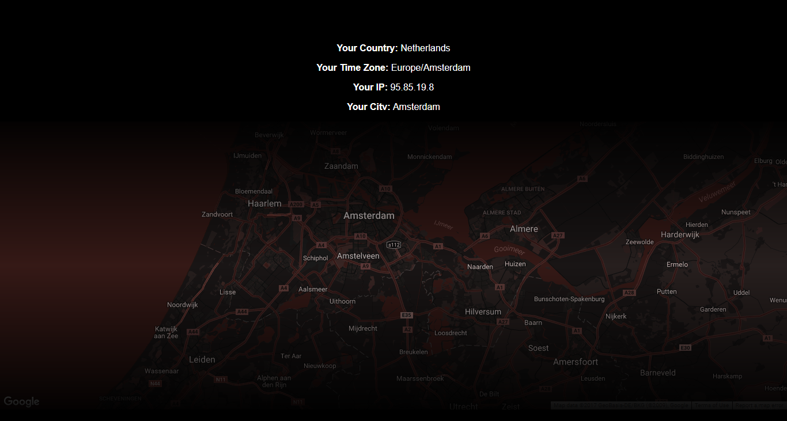

# Location-Tracker

## Using Geo Location and Google Maps API  to fetch and present location

It first fetches the json data from [GeoLocation](http://freegeoip.net/json/) 
then it parses the required data in Google Maps to show the Location.
